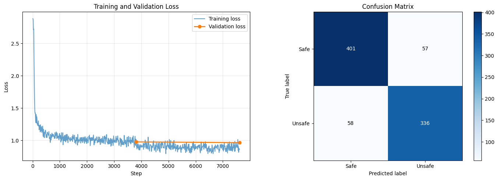

# Training

## Base setup

- **Base model:** `meta-llama/Llama-3.2-3B-Instruct`
- **Method:** QLoRA with PEFT LoRA adapters
- **Trainer:** TRL `SFTTrainer`
- **Task:** binary safety label generation (`Safe` / `Unsafe`)

## Core hyperparameters

- Learning rate: `2e-4`
- Optimizer: `paged_adamw_8bit`
- Batch size: `1` (`gradient_accumulation_steps=4`)
- Sequence length: `512`
- Precision: `bf16=True`, `fp16=False`
- Gradient checkpointing: enabled

## Quantization strategy

- **NF4** (`bnb_4bit_quant_type="nf4"`): robust 4-bit representation for transformer weights.
- **Double quantization** (`bnb_4bit_use_double_quant=True`): reduced memory footprint via quantized scaling constants.
- **BF16 compute** (`bnb_4bit_compute_dtype=torch.bfloat16`): stable low-precision arithmetic on supported hardware.

## LoRA strategy

- Rank (`r`) varied by experiment: 4 / 8 / 16
- Alpha: 16
- Dropout: 0.05
- Target modules:
  - `q_proj`
  - `k_proj`
  - `v_proj`
  - `o_proj`

## Why this setup

The chosen configuration provides a practical compute/performance tradeoff: low VRAM usage, stable training dynamics, and meaningful adaptation capacity for safety-domain specialization.

<!--  -->

