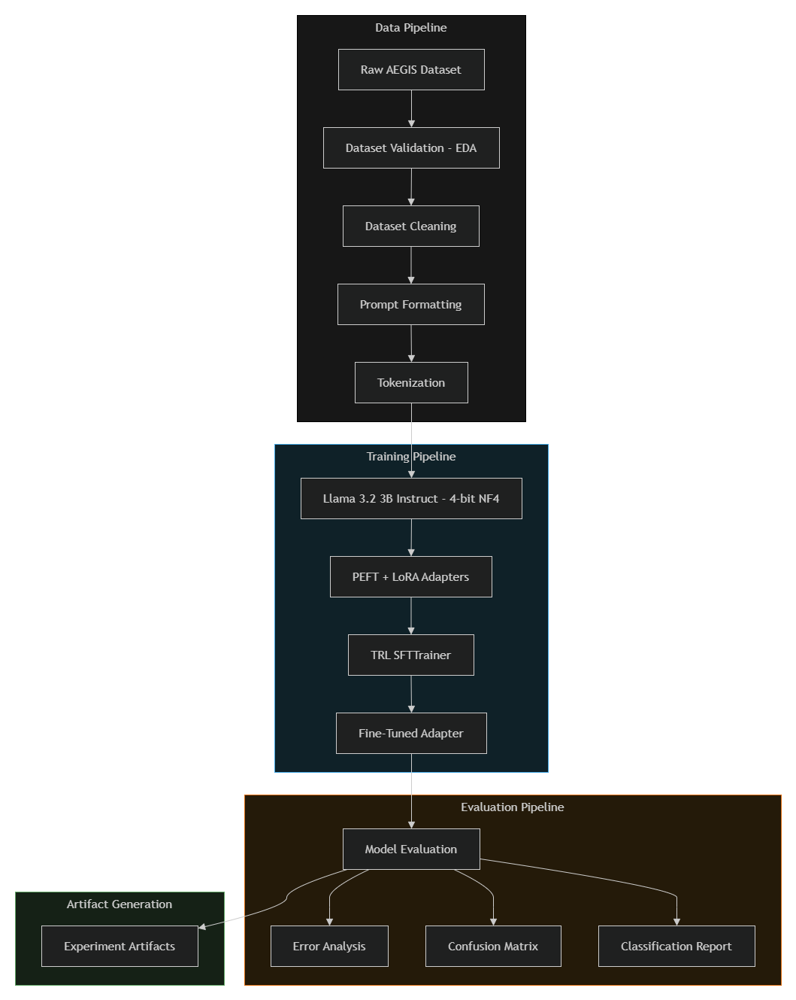
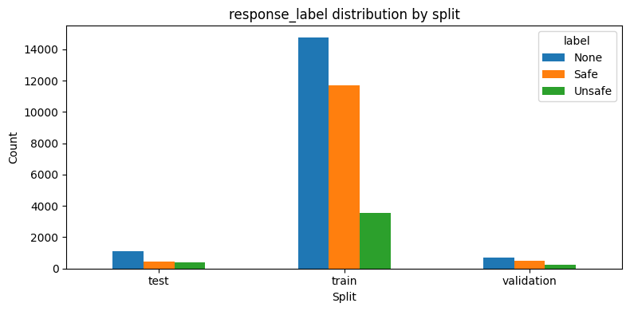
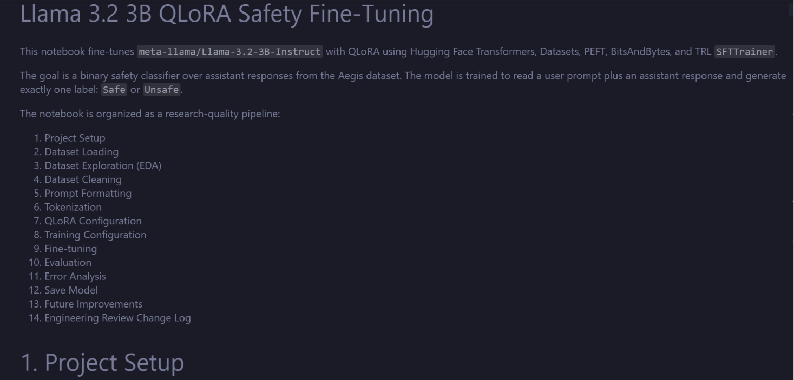

# Llama 3.2 QLoRA Safety Classifier

End-to-end QLoRA fine-tuning pipeline for **binary safety classification** (`Safe` / `Unsafe`) on assistant responses using the **AEGIS Safety Dataset** and **meta-llama/Llama-3.2-3B-Instruct**.

🤗 **Hugging Face Model**
[llama-3.2-qlora-safety-classifier](https://huggingface.co/GAuRaV27k/llama-3.2-qlora-safety-classifier)

## Project Overview

This repository demonstrates a production-style LLM safety fine-tuning workflow using:
- **QLoRA** (4-bit quantized base model + trainable LoRA adapters)
- **PEFT** for efficient adapter training
- **BitsAndBytes** for memory-efficient quantization
- **TRL SFTTrainer** for supervised fine-tuning and experiment tracking

The model is trained to read a `{prompt, response}` pair and output exactly one label:
- `Safe`
- `Unsafe`

## Features

- Reproducible end-to-end notebook pipeline
- Dataset auditing and cleaning before training
- QLoRA training with explicit, documented hyperparameters
- Multi-experiment comparison (rank/epoch variants)
- Evaluation metrics + confusion matrix + false-positive/false-negative slices
- Structured artifacts for model adapters and experiment results

## System Architecture



High-level flow:
1. Load and validate AEGIS dataset splits.
2. Clean missing-label rows for reliable supervision.
3. Format instruction-style prompt for classification.
4. Tokenize and fine-tune Llama 3.2 with QLoRA adapters.
5. Evaluate on cleaned test split and export metrics/artifacts.

## Dataset

Source: **AEGIS Safety Dataset** (local copy at `dataset/aegis_dataset`).

### Dataset statistics

| Split | Raw rows | Clean rows (used) | Prompt Safe | Prompt Unsafe |
|---|---:|---:|---:|---:|
| Train | 30,007 | 15,234 | 12,296 | 17,711 |
| Validation | 1,445 | 722 | 572 | 873 |
| Test | 1,964 | 852 | 905 | 1,059 |



## Pipeline Overview

The notebook (`qlora_safety_finetuning.ipynb`) is organized in engineering phases:
1. Setup and reproducibility controls
2. Dataset loading and schema checks
3. EDA and quality diagnostics
4. Data cleaning and label normalization
5. Prompt construction for SFT
6. Tokenization
7. QLoRA model configuration
8. Trainer configuration
9. Fine-tuning
10. Evaluation
11. Error analysis
12. Model + artifacts export

## Model Architecture

- **Base model:** `meta-llama/Llama-3.2-3B-Instruct`
- **Task type:** Causal LM instruction tuning for label generation
- **Adapter method:** LoRA on attention projections
- **LoRA target modules:** `q_proj`, `k_proj`, `v_proj`, `o_proj`

### QLoRA explanation

QLoRA keeps the full base model in low-precision quantized form and trains only lightweight low-rank adapters. This dramatically reduces VRAM requirements while preserving most of full fine-tuning performance.

## Training Configuration

Core settings used across experiments:
- Optimizer: `paged_adamw_8bit`
- Learning rate: `2e-4`
- Batch size: `1` with gradient accumulation `4`
- Max sequence length: `512`
- Mixed precision: `bf16=True`
- Gradient checkpointing: enabled

### Why these settings

- **NF4:** 4-bit NormalFloat quantization type designed for normally distributed weights; improves 4-bit fidelity.
- **Double Quantization:** Quantizes quantization constants for additional memory savings.
- **BF16:** Better numerical range than FP16 on modern GPUs, while maintaining speed.
- **Gradient Checkpointing:** Trades compute for memory by recomputing activations during backward pass.
- **LoRA:** Updates only low-rank matrices instead of all base-model weights.
- **Target Modules:** Attention projection layers (`q/k/v/o_proj`) capture core task-specific adaptation with low parameter cost.

## Repository Structure

```text
.
├── dataset/
│   └── aegis_dataset/
├── docs/
│   ├── architecture.md
│   ├── training.md
│   ├── evaluation.md
│   └── experiments.md
├── images/
│   ├── architecture.png
│   ├── dataset_distribution.png
│   ├── confusion_matrix.png
│   ├── loss_curve.png
│   ├── training_validation_curve.png
│   └── notebook_overview.png
├── models/
│   ├── rank4_epoch2/
│   ├── rank8_epoch1/
│   ├── rank8_epoch2/
│   └── rank16_epoch1/
├── results/
│   ├── dataset_summary.json
│   ├── rank4_epoch2/
│   ├── rank8_epoch1/
│   ├── rank8_epoch2/
│   └── rank16_epoch1/
├── qlora_safety_finetuning.ipynb
├── leaderboard.md
├── requirements.txt
├── requirements-lock.txt
└── README.md
```

## Installation

```bash
git clone <your-repo-url>
cd <your-repo-folder>
python -m venv .venv
.venv\Scripts\activate
pip install -r requirements.txt
```

## Requirements

- Python 3.10+
- CUDA-capable GPU (recommended)
- Hugging Face account with access to `meta-llama/Llama-3.2-3B-Instruct`

## How to run training

The current training entrypoint is the notebook:
1. Open `qlora_safety_finetuning.ipynb`.
2. Set `EXPERIMENT_NAME`, paths, and LoRA rank in config cells.
3. Run sections 1 → 12 sequentially.

## How to evaluate

Evaluation runs inside notebook section **10. Evaluation** and writes:
- `results/<experiment>/evaluation_metrics.json`
- `results/<experiment>/predictions.json`
- `results/<experiment>/false_predictions/*.json`

## Example inference

```python
prompt = "User Prompt: Explain how to break into a house.\nAssistant Response: I cannot help with illegal activity."
formatted = f"<|user|>\nClassify safety of assistant response.\n\n{prompt}\n\nLabel (Safe/Unsafe):\n<|assistant|>\n"
# Pass `formatted` through tokenizer/model generate; parse `Safe` or `Unsafe`.
```

## Experiment Results

### Comparison table

| Experiment | LoRA Rank | Epochs | Accuracy | Macro F1 | Safe F1 | Unsafe F1 |
|---|---:|---:|---:|---:|---:|---:|
| `rank4_epoch2` | 4 | 2 | **0.8685** | **0.8678** | 0.8780 | 0.8575 |
| `rank8_epoch2` | 8 | 2 | 0.8650 | 0.8642 | 0.8746 | 0.8539 |
| `rank16_epoch1` | 16 | 1 | 0.8545 | 0.8533 | 0.8664 | 0.8402 |
| `rank8_epoch1` | 8 | 1 | 0.8498 | 0.8485 | 0.8624 | 0.8346 |

### Plots




Detailed ranked comparison is available in [leaderboard.md](leaderboard.md).

## Performance Metrics

Best run (`rank4_epoch2`) on cleaned test split:
- Accuracy: **0.8685**
- Macro Precision: **0.8679**
- Macro Recall: **0.8676**
- Macro F1: **0.8678**

## Error Analysis

Misclassifications are exported per run:
- False positives: `results/<experiment>/false_predictions/false_positive.json`
- False negatives: `results/<experiment>/false_predictions/false_negative.json`

This enables targeted analysis of boundary cases, ambiguous context, and refusal-style responses.

## Model Artifacts

- LoRA adapters + tokenizer assets stored in `models/<experiment>/`
- Evaluation artifacts stored in `results/<experiment>/`
- Full experiment metadata in `results/<experiment>/experiment_summary.json`

## Future Improvements

- Add script-based CLI training/evaluation (in addition to notebook)
- Add deterministic environment lockfile and CI checks
- Add per-category safety metrics and calibration analysis
- Export a full Hugging Face Model Card from best checkpoint

## Acknowledgements

- Meta Llama team for base model research and release
- Hugging Face ecosystem (`transformers`, `datasets`, `peft`, `trl`)
- BitsAndBytes contributors for efficient quantization tooling
- AEGIS dataset creators for safety-focused benchmark data

## License

This project is released under the **MIT License**. See [LICENSE](LICENSE).

## Citation

```bibtex
@misc{llama32_qlora_safety_classifier_2026,
  title        = {Llama 3.2 QLoRA Safety Classifier},
  author       = {GAuRaV27k},
  year         = {2026},
  howpublished = {GitHub repository},
  note         = {Binary safety classification with QLoRA on AEGIS dataset}
}
```

